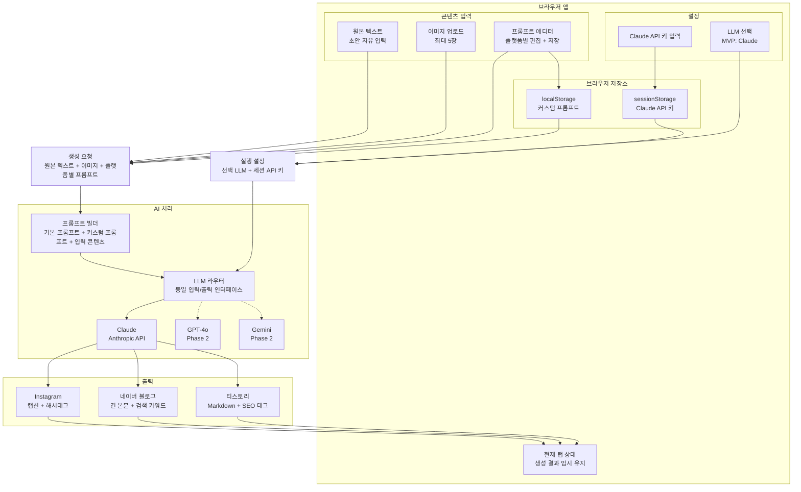

# Snappy

Snappy는 원본 글과 이미지를 입력하면 여러 플랫폼에 맞는 게시글 초안을 생성하는 BYOK 기반 AI 콘텐츠 변환 도구입니다.

MVP에서 검증할 핵심은 하나입니다.

> 원본 글을 붙여넣고 이미지가 있으면 함께 올렸을 때, Instagram, 네이버 블로그, 티스토리용 글이 생성된다.

## MVP 원칙

### 작동하는 루프 하나

초기 제품은 기능의 폭보다 변환 품질과 사용 흐름의 완결성을 우선합니다.

1. 사용자가 본인의 Claude API 키를 입력한다.
2. Snappy가 API 키를 현재 탭 세션에만 보관한다.
3. 사용자가 플랫폼별 프롬프트를 확인하거나 수정한다.
4. 사용자가 원본 텍스트와 이미지를 입력한다.
5. Snappy가 3개 플랫폼용 결과를 생성한다.
6. 사용자가 결과를 복사한다.

## MVP 범위

### 포함

- Claude API 키 입력
- API 키 세션 저장
- 기본 프롬프트 제공
- 플랫폼별 커스텀 프롬프트 저장
- Claude 1개 모델을 통한 3개 플랫폼 변환
- 원본 텍스트 입력
- 이미지 업로드
- Instagram 결과 생성: 캡션 + 해시태그
- 네이버 블로그 결과 생성: 긴 본문 + 검색 키워드
- 티스토리 결과 생성: Markdown + SEO 태그
- 결과 탭 전환
- 결과 복사 버튼

### 제외

| 제외 항목 | 이유 |
| --- | --- |
| GPT / Gemini 실제 연동 | MVP에서는 라우터 구조만 준비하고 Claude 품질 검증에 집중 |
| 플랫폼 실시간 미리보기 | 개발 공수가 크며 초기에는 복사 후 직접 확인 가능 |
| 인라인 편집 | 결과를 복사해 수정하는 흐름으로 충분 |
| 자동 이미지 리사이징 | 업로드 이미지는 AI 분석 컨텍스트로만 사용 |
| 저장 / 히스토리 | 초기에는 현재 브라우저 탭의 결과 유지로 대체 |
| 로그인 / 회원가입 | 초기 전환 마찰이 크며 API 키를 세션에만 저장하면 불필요 |
| 서버 API 키 저장 | 로그인과 서버 보안 책임이 필요하므로 Phase 2로 분리 |

## 제품 구조



## 프롬프트 커스터마이징

각 플랫폼은 기본 시스템 프롬프트를 제공하고, 사용자는 플랫폼별로 커스텀 지시문을 저장할 수 있습니다.

### UI 패턴

- 플랫폼 탭마다 `프롬프트 편집` 토글 제공
- 토글을 열면 텍스트에어리어 표시
- `저장` 버튼으로 사용자 프롬프트 저장
- `기본값 리셋` 버튼으로 플랫폼 기본 프롬프트 복구

### 프롬프트 조합 규칙

```text
최종 프롬프트 = 플랫폼 기본 프롬프트 + 사용자 커스텀 프롬프트 + 출력 형식 지시
```

예시:

```text
기본 제공 시스템 프롬프트:
당신은 Instagram 콘텐츠 전문가입니다.
입력된 글을 캡션 형식으로 변환하고, 관련 해시태그 20개를 추가하세요.

사용자 커스텀 프롬프트:
항상 첫 줄은 질문으로 시작하고, 이모지는 최대 3개만 사용하세요.
```

## LLM 라우터

MVP에서는 Claude만 구현하되, 라우터 계층은 처음부터 분리합니다. 이렇게 하면 GPT, Gemini를 Phase 2에서 추가해도 UI와 저장 구조를 크게 바꾸지 않아도 됩니다.

```ts
type LLMProvider = 'claude' | 'gpt' | 'gemini';

type LLMRequest = {
  provider: LLMProvider;
  apiKey: string;
  prompt: string;
  content: string;
  imageUrls?: string[];
};

async function callLLM(request: LLMRequest): Promise<string> {
  if (request.provider === 'claude') {
    return callAnthropic(request);
  }

  if (request.provider === 'gpt') {
    return callOpenAI(request);
  }

  if (request.provider === 'gemini') {
    return callGoogle(request);
  }

  throw new Error('Unsupported LLM provider');
}
```

## BYOK 정책

Snappy는 사용자가 직접 API 키를 등록하는 BYOK 구조를 사용합니다.

| 방식 | 장점 | 단점 | MVP 결정 |
| --- | --- | --- | --- |
| 세션 저장 | 탭을 닫으면 키가 사라져 보안 부담이 낮음 | 재방문 시 다시 입력 필요 | 채택 |
| 브라우저 로컬 저장 | 재방문 시 편리하고 서버에 키가 남지 않음 | 같은 브라우저에 키가 남으며 XSS 방어가 중요 | 제외 |
| 서버 저장 | 여러 기기에서 사용 가능, 웹/앱 확장에 유리 | 로그인과 서버 보안 책임 발생 | Phase 2 |

MVP에서는 서버나 `localStorage`에 API 키를 저장하지 않습니다. Claude API 키는 현재 탭의 `sessionStorage`에만 보관하고, 탭을 닫으면 사라집니다.

## 저장 모델 초안

### sessionStorage

| 키 | 설명 |
| --- | --- |
| `snappy.apiKey.claude` | 현재 탭 세션에서 사용할 Claude API 키 |
| `snappy.selectedProvider` | 기본 LLM 제공자, MVP 기본값은 `claude` |

### localStorage

| 키 | 설명 |
| --- | --- |
| `snappy.prompts.instagram` | Instagram 커스텀 프롬프트 |
| `snappy.prompts.naverBlog` | 네이버 블로그 커스텀 프롬프트 |
| `snappy.prompts.tistory` | 티스토리 커스텀 프롬프트 |

### 메모리 상태

| 상태 | 설명 |
| --- | --- |
| `sourceText` | 현재 입력된 원본 텍스트 |
| `uploadedImages` | 현재 업로드된 이미지 목록 |
| `outputs` | 현재 생성된 플랫폼별 결과 |

### generations

MVP에서는 생성 결과를 서버에 저장하지 않습니다. Phase 2에서 로그인과 히스토리를 도입할 때 서버 스키마를 추가합니다.

| 컬럼 | 설명 |
| --- | --- |
| id | 생성 기록 id |
| user_id | 사용자 id |
| source_text | 원본 텍스트 |
| image_refs | 업로드 이미지 참조 |
| outputs | 플랫폼별 생성 결과 JSON |
| provider | 사용 LLM |
| created_at | 생성일 |

## 기본 플랫폼 출력

### Instagram

- 짧고 읽기 쉬운 캡션
- 첫 줄 후킹 문장
- 줄바꿈이 있는 모바일 친화적 구성
- 관련 해시태그 20개

### 네이버 블로그

- 검색 유입을 고려한 긴 본문
- 제목 후보
- 소제목 구조
- 검색 키워드
- 자연스러운 문단 구성

### 티스토리

- Markdown 본문
- SEO 제목 후보
- 메타 설명
- 태그 목록
- 소제목 기반 구조

## MVP 빌드 순서

### 1주차: AI 변환 프롬프트 완성

- 3개 플랫폼 기본 프롬프트 작성
- 동일 원본 글로 반복 테스트
- 출력 품질 기준 정의
- Claude 호출 함수 구현
- LLM 라우터 인터페이스 준비

### 2주차: 웹 UI 구현

- API 키 등록 화면
- 원본 텍스트 입력창
- 플랫폼별 프롬프트 편집 UI
- 결과 탭
- 복사 버튼

### 3주차: 이미지 업로드와 테스트 배포

- 이미지 업로드 UI
- 최대 5장 제한
- 업로드 이미지를 Claude 요청 컨텍스트에 포함
- 테스트 배포

### 4주차: 사용자 피드백과 Phase 2 결정

- 실제 사용자 테스트
- 출력 품질 피드백 수집
- 프롬프트 기본값 개선
- GPT / Gemini 연동 여부 결정
- 플랫폼 미리보기와 히스토리 우선순위 결정

## Phase 2 후보

- GPT 연동
- Gemini 연동
- 로그인 / 회원가입
- 서버 암호화 API 키 저장
- 플랫폼별 실시간 미리보기
- 생성 히스토리 저장
- 결과 인라인 편집
- 이미지 자동 리사이징
- 팀/워크스페이스 기능
