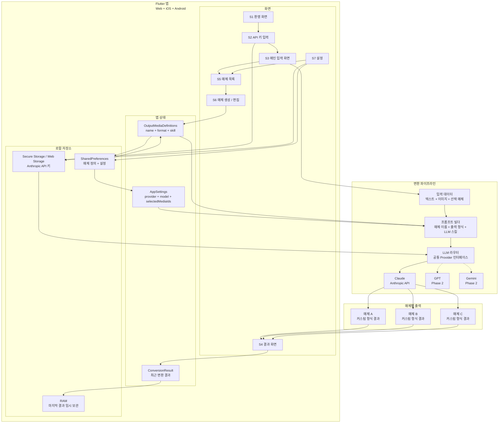

# Snappy

Snappy는 원본 컨텐츠 하나를 입력하면 사용자가 직접 정의한 여러 출력 매체에 맞게 결과를 한 번에 생성하는 Flutter 앱입니다.

상세 기획은 [PLANNING.md](PLANNING.md)를 기준으로 합니다. README는 구현자가 빠르게 방향을 확인하기 위한 요약 문서입니다.

## 핵심 정의

> 하나의 컨텐츠로 여러 매체를, 한 번에.

Snappy의 MVP에서 검증할 핵심은 하나입니다.

> 사용자가 원본 텍스트와 이미지를 입력하면, 선택한 매체 정의에 따라 결과가 생성되고 바로 복사해서 게시할 수 있다.

## MVP 결정 사항

| 항목 | 결정 |
| --- | --- |
| 플랫폼 | Flutter, Web + iOS + Android |
| 웹 출시 | MVP 포함 |
| 백엔드 | 없음 |
| 로그인 | 없음 |
| API 키 | BYOK, 유저가 발급한 Anthropic API 키 사용 |
| API 키 저장 | `flutter_secure_storage`로 기기/브라우저 보안 저장 |
| 일반 설정 저장 | `shared_preferences` |
| LLM | MVP는 Claude 단독 |
| 확장성 | LLM 라우터 구조로 GPT/Gemini Phase 2 대응 |
| 출력 매체 | 유저가 직접 생성 |
| 매체 정의 | 매체 이름 + 출력 형식 + LLM 스킬 |
| 기본 프리셋 | 인스타그램, 블로그, 뉴스레터 등 예시 제공 |

## MVP 범위

### 포함

- 최초 온보딩
- Flutter Web 앱 출시
- Anthropic API 키 안내, 입력, 검증
- API 키 기기/브라우저 보안 저장
- 원본 텍스트 입력
- 이미지 첨부, 최대 5장
- 매체 생성: 매체 이름, 출력 형식, LLM 스킬 입력
- 대상 매체 선택
- Claude 기반 선택 매체 병렬 변환
- 매체별 결과 탭
- 복사 버튼
- 다시 생성 버튼
- 매체 목록 페이지
- 매체 생성 / 편집 페이지
- 설정 화면

### 제외

| 제외 항목 | 이유 |
| --- | --- |
| 회원가입 / 로그인 | 기기와 브라우저 단독 동작으로 진입 장벽 최소화 |
| 결제 / 구독 | Free + BYOK 모델로 먼저 검증 |
| 백엔드 / 서버 저장 | 운영비와 보안 책임 없이 MVP 검증 |
| 히스토리 영구 저장 | 마지막 결과만 메모리에 임시 보관 |
| 매체 자동 발행 | 결과 복사 후 사용자가 직접 게시 |
| 이미지 자동 편집 / 리사이징 | MVP에서는 LLM 분석 컨텍스트로만 활용 |
| 팀 / 협업 기능 | 1인 사용 우선 |
| 분석 / 통계 | 실제 게시 성과는 외부 플랫폼에서 확인 |

## 제품 구조



## 사용자 흐름

### 첫 사용

1. 환영 화면을 본다.
2. Anthropic API 키가 필요하다는 안내를 확인한다.
3. API 키 발급 가이드를 열어 키를 발급한다.
4. 앱에 API 키를 붙여넣는다.
5. 앱이 API 키를 검증한다.
6. 유효한 키는 기기 또는 브라우저 로컬 보안 저장소에 저장된다.
7. 기본 매체 프리셋을 확인하고 필요하면 새 매체를 만든다.
8. 메인 화면으로 진입한다.

### 일반 사용

1. 앱을 실행한다.
2. 원본 텍스트를 입력한다.
3. 이미지를 선택적으로 첨부한다. 최대 5장.
4. 변환할 매체를 선택한다.
5. 변환 버튼을 누른다.
6. Claude가 선택된 매체 결과를 병렬 생성한다.
7. 결과 화면에서 매체별 탭을 확인한다.
8. 복사하거나 다시 생성한다.
9. 외부 앱으로 이동해 직접 게시한다.

## 화면 구성

| 화면 | 역할 |
| --- | --- |
| S1 환영 화면 | 최초 1회 표시되는 온보딩 슬라이드 |
| S2 API 키 입력 화면 | Anthropic API 키 발급 안내, 입력, 검증 |
| S3 메인 화면 | 원본 컨텐츠 입력, 이미지 첨부, 매체 선택, 변환 시작 |
| S4 결과 화면 | 매체별 탭, 복사, 다시 생성 |
| S5 매체 목록 화면 | 생성된 매체 목록, 새 매체 만들기, 편집/삭제 진입 |
| S6 매체 생성 / 편집 화면 | 매체 이름, 출력 형식, LLM 스킬 입력 |
| S7 설정 화면 | API 키 변경, 매체 관리, 앱 정보 |

## 매체 생성 기능

유저는 독립된 매체 관리 페이지에서 출력 매체를 직접 만들고, 생성 시 다음 3가지 값을 입력합니다.

| 입력 | 설명 |
| --- | --- |
| 매체 이름 | 메인 화면 선택 목록과 결과 탭에 표시되는 이름 |
| 출력 형식 | 결과가 따라야 하는 구조, 섹션, Markdown 여부, 태그/CTA 포함 여부 |
| LLM 스킬 | 해당 매체의 문체, 금지 사항, 최적화 기준, 반복 사용되는 프롬프트 규칙 |

### 생성 / 편집 규칙

- 메인 화면의 매체 영역 또는 설정 화면에서 `매체 관리` 페이지로 진입합니다.
- `매체 관리` 페이지에서 `새 매체 만들기`를 누르면 `매체 생성 / 편집` 페이지로 이동합니다.
- 기본 프리셋은 복제해서 수정할 수 있습니다.
- 기본 프리셋 원본은 삭제하지 않습니다.
- 유저가 만든 매체는 수정/삭제할 수 있습니다.
- 저장 후 즉시 메인 화면의 매체 선택 목록에 표시됩니다.
- 매체는 최소 1개 이상 존재해야 합니다.

### 페이지 이동

```text
S3 메인 화면
  ├─ 매체 관리 -> S5 매체 목록 화면
  └─ 변환하기 -> S4 결과 화면

S5 매체 목록 화면
  ├─ 새 매체 만들기 -> S6 매체 생성 화면
  ├─ 매체 편집 -> S6 매체 편집 화면
  └─ 뒤로 -> S3 메인 화면 또는 S7 설정 화면

S6 매체 생성 / 편집 화면
  ├─ 저장 -> S5 매체 목록 화면
  ├─ 삭제 -> S5 매체 목록 화면
  └─ 뒤로 -> S5 매체 목록 화면

S7 설정 화면
  └─ 매체 관리 -> S5 매체 목록 화면
```

### 저장 규칙

| 동작 | 처리 |
| --- | --- |
| 생성 | UUID 기반 `id` 발급 후 SharedPreferences의 매체 목록에 추가 |
| 수정 | 동일 `id`의 매체 정의 갱신 |
| 삭제 | `isDefaultPreset == false`인 매체만 삭제 가능 |
| 복제 | 새 `id`와 `isDefaultPreset = false`로 저장 |
| 선택 | `selectedMediaIds`에 저장 |

## 기술 스택

| 영역 | 선택 |
| --- | --- |
| 프레임워크 | Flutter 최신 안정 버전 |
| 언어 | Dart 3 |
| 상태 관리 | Riverpod |
| HTTP 클라이언트 | dio |
| 라우팅 | go_router |
| API 키 저장 | flutter_secure_storage |
| 일반 설정 저장 | shared_preferences |
| 이미지 선택 | image_picker |
| 이미지 압축 | flutter_image_compress |
| Markdown 렌더링 | flutter_markdown |
| 외부 링크 | url_launcher |
| 로깅 | logger |

## 프로젝트 구조

```text
snappy/
├── lib/
│   ├── main.dart
│   ├── app/
│   │   ├── app.dart
│   │   ├── router.dart
│   │   └── theme.dart
│   ├── core/
│   │   ├── llm/
│   │   │   ├── llm_provider.dart
│   │   │   ├── anthropic.dart
│   │   │   ├── openai.dart
│   │   │   └── google.dart
│   │   ├── storage/
│   │   │   ├── secure_storage.dart
│   │   │   └── prefs_storage.dart
│   │   └── prompts/
│   │       ├── prompt_builder.dart
│   │       └── media_presets.dart
│   ├── media/
│   │   ├── output_media.dart
│   │   └── media_repository.dart
│   ├── features/
│   │   ├── onboarding/
│   │   ├── home/
│   │   ├── result/
│   │   ├── media_list/
│   │   ├── media_editor/
│   │   └── settings/
│   └── shared/
│       ├── widgets/
│       └── models/
├── assets/
│   └── images/
├── web/
│   ├── index.html
│   └── manifest.json
├── android/
├── ios/
├── pubspec.yaml
├── PLANNING.md
└── README.md
```

## LLM 라우터

MVP에서는 Claude만 구현하지만 모든 LLM은 같은 인터페이스를 따릅니다.

```dart
abstract class LLMProvider {
  String get name;
  String get defaultModel;

  Future<String> generate({
    required String apiKey,
    required String systemPrompt,
    required String userContent,
    List<ImageData>? images,
    String? model,
  });

  Future<bool> validateApiKey(String apiKey);
}
```

### 호출 흐름

1. `flutter_secure_storage`에서 API 키를 읽는다.
2. `shared_preferences`에서 매체 정의와 설정을 읽는다.
3. 이미지가 있으면 압축하고 base64 인코딩한다.
4. 선택된 매체를 `Future.wait`로 병렬 호출한다.
5. 성공한 결과는 탭에 표시한다.
6. 실패한 매체는 해당 탭에 재시도 버튼을 표시한다.

## 데이터 저장

모든 MVP 데이터는 기기 또는 브라우저 로컬 저장소에만 존재합니다.

| 저장소 | 내용 |
| --- | --- |
| Secure Storage / Web Storage | Anthropic API 키 |
| SharedPreferences | 선택 LLM, Claude 모델, 선택 매체, 매체 정의, 온보딩 완료 여부 |
| 메모리 | 최근 변환 결과 |

웹 BYOK에서는 브라우저가 사용자의 Anthropic API 키로 `api.anthropic.com`에 직접 요청합니다. 이 요청에는 Anthropic의 브라우저 직접 호출 옵트인 헤더인 `anthropic-dangerous-direct-browser-access: true`를 포함합니다.

### OutputMediaDefinition

```dart
class OutputMediaDefinition {
  final String id;
  final String name;
  final String outputFormat;
  final String llmSkill;
  final bool isDefaultPreset;
  final DateTime createdAt;
  final DateTime updatedAt;
}
```

### AppSettings

```dart
class AppSettings {
  final LLMProviderType provider;
  final String anthropicModel;
  final List<String> selectedMediaIds;
  final List<OutputMediaDefinition> mediaDefinitions;
  final bool onboardingDone;
}
```

### ConversionResult

```dart
class ConversionResult {
  final String originalText;
  final List<ImageData> images;
  final Map<String, MediaResult> results;
  final DateTime createdAt;
}

class MediaResult {
  final String mediaId;
  final String mediaName;
  final String? text;
  final String? error;
  final Map<String, dynamic>? metadata;
}
```

## 매체 프롬프트 시스템

### 매체 정의 입력값

| 입력 | 설명 | 예시 |
| --- | --- | --- |
| 매체 이름 | 결과 탭과 선택 목록에 표시되는 이름 | 인스타그램, 블로그, 뉴스레터 |
| 출력 형식 | 최종 결과가 따라야 할 구조 | 캡션 + 해시태그, Markdown, 이메일 초안 |
| LLM 스킬 | 해당 매체의 문체, 규칙, 금지 사항, 최적화 기준 | 첫 줄은 질문, 이모지 3개 이하, CTA 포함 |

### 프롬프트 조합

```text
최종 시스템 프롬프트 =
  Snappy 공통 변환 지시문
  + 매체 이름
  + 출력 형식
  + LLM 스킬
  + 원본 입력 처리 규칙
```

### 기본 매체 프리셋

| 매체 이름 | 출력 형식 | LLM 스킬 |
| --- | --- | --- |
| 인스타그램 | 캡션 본문 + 해시태그 20개 | 첫 줄 후킹, 짧은 문단, 이모지 적절히 사용 |
| 블로그 | 제목 + 긴 본문 + 검색 키워드 | 정보성 구조, 소제목 3개 이상, 검색 유입 고려 |
| 뉴스레터 | 제목 + 도입부 + 본문 + CTA | 구독자에게 말하듯 작성, 마지막에 행동 유도 |

## 에러 처리

| 상황 | 처리 |
| --- | --- |
| API 키 무효 | 키 오류 안내 + 설정 화면 이동 |
| 크레딧 부족 | 크레딧 부족 안내 + 충전 페이지 링크 |
| Rate Limit | 잠시 후 재시도 안내 + 지수 백오프 |
| 네트워크 오류 | 연결 확인 안내 + 재시도 버튼 |
| 일부 매체 실패 | 성공한 탭은 표시, 실패한 탭만 재시도 |

## MVP 일정

| 주차 | 주제 | 산출물 |
| --- | --- | --- |
| 1주차 | 매체 정의 + 라우터 | 기본 매체 프리셋, 매체 기반 프롬프트 조립, Claude API 호출, CLI 검증 |
| 2주차 | 핵심 화면 | 메인 화면, 결과 화면, 변환 흐름 |
| 3주차 | 주변 화면 | 온보딩, API 키 입력, 매체 목록, 매체 생성/편집, 설정, 이미지 업로드 |
| 4주차 | 출시 준비 | 웹 배포, iOS TestFlight, Android 내부 테스트, 베타 피드백 |
| 5주차+ | 출시 | 웹 공개, App Store, Play Store 정식 출시 |

## Phase 2 후보

- 생성 히스토리
- GPT 연동
- Gemini 연동
- 랜딩 페이지
- 결제 / Pro 플랜
- 매체별 미리보기 강화
- 이미지 편집 / 리사이징
- 팀 / 협업 기능

## 검증 지표

| 지표 | 목표 |
| --- | --- |
| Day 7 / Day 30 리텐션 | 30% 이상 |
| 변환 횟수 / 유저 | 주당 평균 5회 이상 |
| 재생성 비율 | 30% 이하 |
| API 키 입력 완료율 | 50% 초과 |
